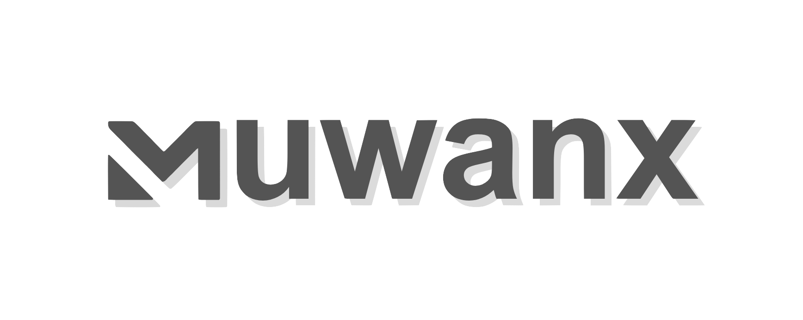

<div align="center">
  
</div>
<div align="center">
    <em>MuJoCo + ONNX Reinforcement Learning Playground in Your Browser</em>
</div>

<br>

<p align="center">
    <a href="https://github.com/ttktjmt/muwanx/actions/workflows/deploy.yml"></a>
    <a href="https://ttktjmt.github.io/muwanx/"></a>
    <a href="https://github.com/ttktjmt/muwanx/blob/main/LICENSE"></a>
</p>

---

**Muwanx** is a client-side reinforcement learning playground powered by [mujoco_wasm](https://github.com/zalo/mujoco_wasm) and [ONNX Runtime](https://github.com/microsoft/onnxruntime). It enables real-time MuJoCo simulations with trained policy control, running entirely in your browser - no server for simulation required.  
Perfect for sharing interactive demos as static sites (such as GitHub Pages), rapidly prototyping RL policies, or building customizable environments for experimentation and visualization.

### 🚀 [Visit the Live Demo](https://ttktjmt.github.io/muwanx/)

## Features
- **Real-time**: Run MuJoCo simulations with real-time policy control.
- **Interactive**: Change the state of objects by applying forces.
- **Cross-platform**: Works seamlessly on desktop and mobile devices.
- **Client-only**: All computation runs in the browser. No server for simulation required.
- **Easy Sharing**: Host as a static site for effortless demo distribution (e.g., GitHub Pages).
- **Customizable**: Add your own MuJoCo models and ONNX policies quickly.

## Quick Start

To run muwanx locally, ensure you have [Node.js](https://nodejs.org/) installed.

Clone the repository:
```bash
git clone https://github.com/ttktjmt/muwanx.git
cd muwanx
```

Install the dependencies and start the development server:
```bash
npm install
npm run dev
```

Open your browser and navigate to the localhost URL shown in the terminal to see muwanx in action.

## Acknowledgments

This project has greatly benefited from the contributions of the [Facet](https://github.com/Facet-Team/facet) project by the research group at Tsinghua University.

## License

This project is licensed under the terms of the MIT open source license. Please refer to the [LICENSE](./LICENSE) file for the full terms.
